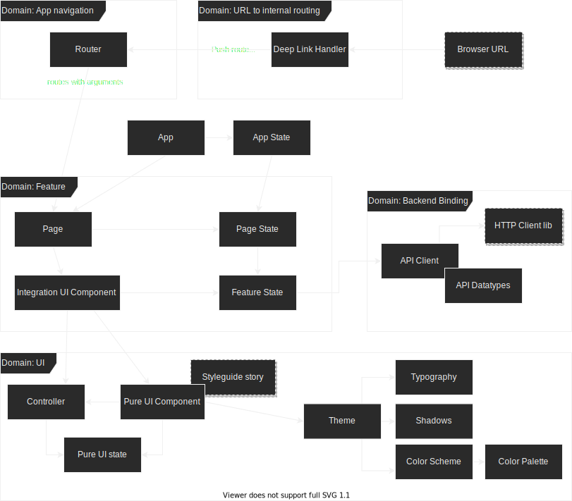

# Disclaimer
The whole architecture is highly opinionated to my personal knowledge and experience.
And thus this is only written from my point of view.
Because languages, frameworks and my opinion changes over time, this architecture is work in progress.
I *do not* claim that this works for everyone and every project, but it works for all projects that i encountered so far.
I will not go in depth with all aspects but want to provide a top level architecture which allows to be extended by other architecture patterns for different needs.
The approach might have a lot in common with other approaches.
I *do not* claim to reinvent the frontend architecture.
I merely define my personal blueprint.

# Motivation
Before I discuss my blueprint, I have to introduce myself, and why I made up this architecture blueprint.
I see myself as a fullstack developer, especially because I like to simplify and visualize complex processes which help people to do what they can and want to do efficiently.
As fullstack developer I have my comfortzone in back- and frontend equally.
With backend development I learned a lot from clean coding, clean code developers, architecture, evolvability, reusability and domain driven (software) design (DDD).
In frontend I had to deal with a lot of frustration as I often saw that almost nothing what we learned from backend architecture is applied to frontend client architectures especially to UI elements.
Modern frontend frameworks provide a hugh step forward to build efficient UI clients and I think let us apply all known aspects.
During work within both worlds I made myself a mental model, how the frontend works best for myself by combining all the aspects that I learned software development.
This is my bleprint for an architecture that I think works with all modern frontend frameworks to build a full functional fat or slim UI client for web and mobile.

# TL;DR Show me a Diagram!

# Requirements to my Architecture
I have some requirements to my architecture which explains my intent of the structure:
* Reusability of UI elements,
* Simplicity by using known architecture patterns,
* Seperation of concerns in UI, behaviour, state management and features, and
* Definition of domains.

These requirements do not look new to software developers, but I see that they are often missing in frontends.

DDD is not only applicable on a feature level, but also on a non functional level.
Like it is possible to define a domain for security or tracking, I see it is also possible for UI elements.

## What about MVC, MVP, MVVM?
Actually in my opinion, it does not matter.
Choose one and stick to it and make it clearly visible to future developers.
It might actually sometimes be useful to choose other approaches for different features in an app because it saves a lot of boilerplate or it would simply is too confusing.
Some frameworks actually dictate or prefer a certain kind approach, like Angular strictly prefers MVC.
In web component with React, Vue or Svelte it is your choice.

## Separation of Pure UI and Feature Integrating UI
When using a UI library, all UI elements are independent and free of app features.
Which is pretty obvious because they were build for anything and it's unable to know all appliances.

When building your own app it is very useful to build your own little UI library.
This might sound like a great deal.
But actually, it is already achieved by a shift of domains.
While the feature implementation focuses on the app features, the UI library focuses on the UI itself without knowing anything of the app.
Each little UI element might have its own little featureset that is completely unaware of its use in the app while the feature integrating UI places those indepoendent UI elements within a context of the app feature.
Naming of variables, classes and parameters are focused on the UI element in pure UI and on the application context on the feature UI.

As a little example, imagine to view the `Avatar` of a user.
With the little trick of building a pure UI component which displays any image in the style of the `Avatar` you want to show, you might also want to implement a component which loads that picture, maybe caches it and displays it as that same `Avatar`.
Instead of only building up the integrated version of that `Avatar`, there are 2 components which give a lot of advantages.

The highest advantage of building a pure UI is, that anything can be contextfree developed, well documented, bugfixed and visually tested for itself with a styleguide.
Styleguides can be automatically generated with each build in the CI pipeline and are called living styleguides, because their styling is from productive code instead of a separate documentation.
Well known styleguides for web frontend are Styleguidist or StoryBook.
Similar styleguides are available for ReactNative, Flutter, Ionic and other mobile libaries.

Visual testing is considered the most valuable testing of UI.
UX is almost impossible to test automatically by code alone, which leads to no way around visual testing in the end.
And instead of the need to test all edge cases in the integrated application UI, it is easier to mock all thinkable edge cases within a styleguide and test them that way.
This actually is similar to building unit tests for the backend, which also cover all edgecases for that unit of code, but this time this is for the UI.
It also gives the opportunity to test out new behaviour of certain UI elements for itself like dropdowns or autocomplete, or the opportunity to fix layout issues on multiple platforms.

## Separation of Views from UI Components
In every app there might be UI elements that are definitely only visible once on the screen like a page and some that are definitely visible multiple times on the same screen.
For development it always helps to identify and know what the element is made for.
Documentation might help, but it is quite quicker to distinguish between them by separate naming or module conventions like different suffix or a subdirectory.
Each one of them also needs a different documentation style: While UI components stand for themselves, view components often might describe specific layouting with a lot of placeholders to place UI elements.

## Separation of Feature State and UI State
> TODO

## Separation of Global State and Component State
> TODO

## Separation of UI and Behaviour
> TODO

# My Architecture
Back to the diagram.

## Routing
> TODO

## Client API
> TODO

## Pure UI
> TODO

## Feature integrating UI
> TODO
